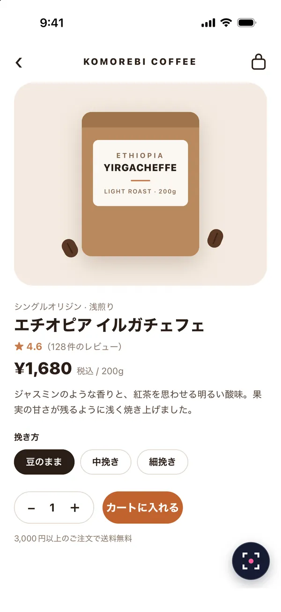
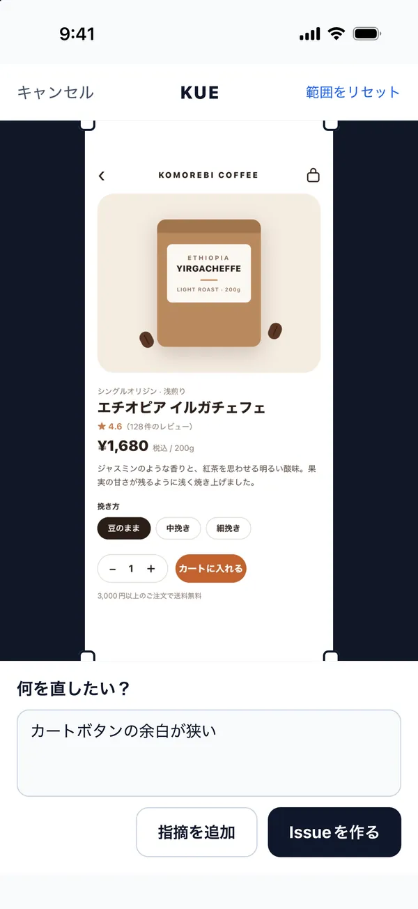
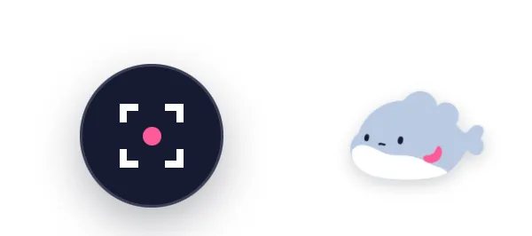
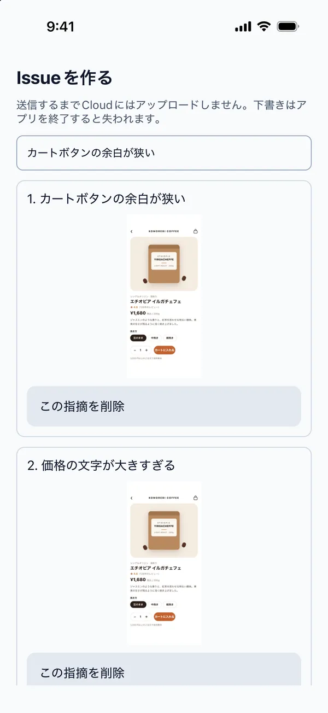
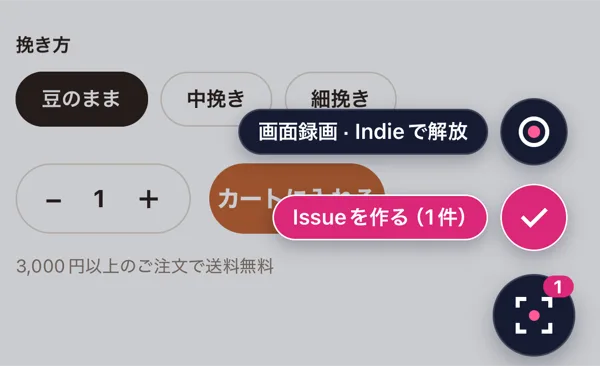

# KUE Documentation

KUE adds screen capture, cropping, and memo entry to Expo / React Native apps. Reports can be submitted to KUE Cloud for GitHub Issue creation or passed to an application-defined storage handler.

Target version: SDK and CLI **0.4.0**. Cloud limits describe the current production service. Recording also requires a native build that includes the recorder and an active entitlement.

## Requirements

| Component | Supported environment |
| --- | --- |
| Application | Expo SDK 54–57 / React Native |
| OS | iOS and Android. Web screen capture is not supported |
| CLI | Node.js 22.13 or later |
| License | SDK and CLI: MIT. Cloud: a separately provided hosted service |

When building an Expo SDK 57 app with Xcode 27 (the iOS 27 SDK), use `expo@57.0.23` or later, set `ios.enableSceneSupport` to `true` in `expo-build-properties`, and regenerate the iOS project. An app built with the iOS 27 SDK without scene support cannot launch on iOS 27.

Cloud integration requires a GitHub account and installation of the KUE QA GitHub App on the destination repository. The connecting user must own the personal repository or be an organization owner, and must also have administrator permission on the repository. Contact [support](mailto:kue@ischca.dev) if the App cannot be installed.

Custom storage through `onSubmit` does not require a Cloud account. Standard SDK installation and upgrades do not require yalc.

## CLI setup

### Procedure

Save application changes, then run the command from the Expo app package or the workspace root.

```sh
npx kue-qa init
```

If the current package declares an `expo` dependency, the CLI uses it directly. Otherwise, it detects Expo apps from `packages` in `pnpm-workspace.yaml` or `workspaces` in `package.json`. When both exist, the pnpm definition takes precedence. One candidate is selected automatically. Multiple candidates are listed and setup stops without changes. To select an app explicitly:

```sh
npx kue-qa init --app apps/mobile
```

Automatic discovery stays within the invocation directory. It skips hidden directories, symbolic links, `node_modules`, `vendor`, `build`, `dist`, `coverage`, `ios`, and `android`. If the search exceeds 2,000 directories or no workspace definition exists, use `--app` or run inside the app. `--app` must select a directory inside the invocation directory without symbolic links.

1. The CLI detects the root component and GitHub repository.
2. On first setup or explicit reconnection, sign in with GitHub in the browser, verify the destination, and press **Connect**. Authorize access to the target repository on GitHub only if required.
3. The CLI installs the SDK and dependencies, then adds KUE to the root component.
4. Review the diff and start Expo. Rebuild the development client if native dependencies were added.
5. Submit a report and verify its delivery status and Issue in the [dashboard](https://kue.ischca.dev/en/app).

Setup approval links expire after 15 minutes. Approve only setups initiated from your own terminal. Running `init` does not create an Issue.

After connection completes, the URL changes to the regular dashboard (`/en/app`). Opening an expired connection link also displays the dashboard after sign-in. Projects already set up do not need to reconnect. Run `init` again only if CLI setup is incomplete.

The destination repository's GitHub owner determines the workspace. The first connecting user becomes its KUE workspace owner. When a workspace already exists, another GitHub organization owner does not automatically receive KUE management access.

The connection page displays the CLI's fixed destination. Press **Connect** to connect immediately if access is already granted. Otherwise, the same tab opens GitHub. Choose the personal account or organization, then use **Only select repositories** to grant access only to the target repository. On return to KUE, access to the original destination is checked again and the connection completes. No second press of **Connect** is required.

After saving access on GitHub, use your browser's **Back** button to return to the original connection page if you are not redirected to KUE. The connection also resumes when you return this way.

The initial action is bound to the browser, signed-in account, and destination, and resumes once within its validity period. Canceling on GitHub, granting a different repository, or awaiting organization approval does not complete the connection. After approval, press **Reload**, then **Connect**. If an incomplete setup has expired, restart the CLI's `init` command. GitHub authorization cannot be skipped.

### Idempotent init

The following behavior applies to CLI 0.3.4 and later. Version 0.3.3 and earlier repeat connection approval, dependency installation, and configuration writes on subsequent runs.

Ordinary `init` exits without browser approval, package-manager execution, or file writes when the managed connection, integration, and installed dependencies are unchanged. File modification times and the lockfile are preserved. With `recording: auto`, it still reads the current Cloud plan; `off` skips that read. Existing 0.3.3 configuration files are supported. Local-state and plan checks do not guarantee that submission is available.

| State or option | Behavior |
| --- | --- |
| SDK upgrade | Update to the CLI's SDK version. Preserve the connection and compatible existing native dependencies. An older CLI does not downgrade a newer SDK |
| Missing dependency | Add only undeclared SDK or required native dependencies. Native version ranges come from the installed Expo package |
| Inconsistent dependencies | Stop if a declared package is not installed or versions are inconsistent. Restore dependencies from the lockfile or review an explicit dependency update first |
| `--reconnect` | Explicitly request browser approval and retrieve configuration again. Combine with `--repository OWNER/REPO` to change destinations or `--server URL` to change servers |
| `--config project.json` | Apply the explicitly supplied configuration without rewriting identical values. Cannot be combined with `--reconnect`, `--repository`, or `--server` |
| `--skip-install` | Skip dependency checks and additions. This does not indicate that dependencies are correctly installed |
| `--sdk sdk.tgz` | Compare the local tarball's content hash and installation state. Identical inputs do not reinstall it. Continue supplying this option when using the local tarball |
| Inconsistent managed files | Never execute JavaScript configuration or silently reset invalid configuration, integration, or customized type declarations; stop instead |

After browser approval, `.kue/setup.json` stores the destination and configuration hash. For a local tarball it stores the content hash and SDK version. It contains no authentication tokens or absolute paths and may be committed. If the destination is not recorded, as with older configurations, supplying `--repository` requires explicit `--reconnect`. Ordinary reruns never change the destination based on changes to the Git remote.

When an installation is necessary, the package manager may update related lockfile entries. Review the diff. Explicit `--reconnect` requests approval on every run.

### Options

| Option | Behavior |
| --- | --- |
| `--dry-run` | Display detection results without network requests or file changes |
| `--app apps/mobile` | Select the Expo package. Relative paths use the command's invocation directory |
| `--repository OWNER/REPO` | Specify the destination GitHub repository |
| `--reconnect` | Explicitly retrieve connection configuration again; also required to change an existing destination or server |
| `--root app/_layout.tsx` | Specify the root file to modify |
| `--no-open` | Print the approval link without opening a browser |
| `--config project.json` | Use public configuration JSON from the dashboard instead of browser approval |
| `--skip-install` | Skip dependency installation; install required packages separately |
| `--skip-integration` | Keep a manually mounted component without reading or editing JSX. Cannot be combined with `--root` |
| `--recording auto\|off` | Include the recorder according to the plan or explicitly exclude it. Default: `auto` |
| `--server https://YOUR-KUE-HOST` | Override the Cloud server. Default: `https://kue.ischca.dev` |
| `--sdk /path/to/sdk.tgz` | Use a local SDK tarball for testing |

Relative `--root` paths use the selected app directory. Relative `--config` and `--sdk` paths use the command's invocation directory. Dependencies and `.kue` are added inside the selected app. Package-manager detection checks `packageManager` and lockfiles from the app up through its parent directories.

With `--config`, the server URL comes from the JSON file. If the root component structure is unsupported by the CLI, integrate the SDK manually.

### Generated files

| File | Contents and handling |
| --- | --- |
| `.kue/config.js` / `.kue/config.d.ts` | Connection configuration and types, including the public project key. May be committed |
| `.kue/backup-*.txt` | Original application source. Keep local and exclude from commits |

The CLI does not store GitHub user tokens or billing credentials in the application.

### Setup for manually mounted components

In CLI 0.4.0, use `--skip-integration` for applications that already mount `Kue` through a custom wrapper. It manages connection configuration, dependencies and recording build settings without reading or editing JSX. It cannot be combined with `--root`.

```sh
kue-qa init --skip-integration
kue-qa init --skip-integration --reconnect
```

Once, pass `kueCloudConfig` from `.kue/config.js` and `kueRecordingMode` from `.kue/recording.js` to the existing `Kue` component. The CLI does not verify the manual integration. Subsequent runs reuse the connection and leave files unchanged when configuration and dependencies match. Auto mode still performs a read-only plan request. Use `--reconnect` to retrieve the key again or change the destination.

After a newer CLI updates the SDK, review the diff and use the application's existing build and distribution workflow. Changes to native recording inclusion require a native rebuild. The CLI does not start builds or distribute to TestFlight or Google Play.

## Manual SDK installation

### Dependencies

Install SDK 0.4.0 with the application's existing package manager and maintain one lockfile format.

```sh
npm install @kue-qa/react-native@0.4.0
npx expo install expo-application expo-constants expo-device expo-file-system expo-image-manipulator react-native-view-shot react-native-safe-area-context
```

### Cloud connection and mounting

Add the public configuration obtained from the dashboard to `.env.local`. Replace the example key with the project key of the target project. Do not use GitHub tokens or private keys.

```dotenv
EXPO_PUBLIC_KUE_API_BASE_URL=https://kue.ischca.dev
EXPO_PUBLIC_KUE_PROJECT_KEY=pk_REPLACE_WITH_PROJECT_KEY
```

Mount one `Kue` component at the application root. The following example uses Expo Router's `app/_layout.tsx`.

```tsx
import { Stack } from 'expo-router';
import { Kue } from '@kue-qa/react-native';

export default function RootLayout() {
  return (
    <>
      <Stack />
      <Kue cloud={{
        apiBaseUrl: process.env.EXPO_PUBLIC_KUE_API_BASE_URL!,
        projectKey: process.env.EXPO_PUBLIC_KUE_PROJECT_KEY!,
      }} />
    </>
  );
}
```

Replace `Stack` with `Slot` when required by the router configuration. Without Expo Router, mount KUE in the application's root component. Environment variables are read by application code; the SDK does not read them automatically.

### Custom storage

`onSubmit` receives a `KueLocalReport` and returns `void` or `Promise<void>`. In the example, `saveReportAndCopyImage` is a storage function implemented by the application. `submitLabel` names the action on the submit button.

```tsx
<Kue
  onSubmit={async (report) => {
    await saveReportAndCopyImage(report);
  }}
  submitLabel="Save report"
/>
```

Configure either `cloud` or `onSubmit`; omitting both is a type error. When both are configured, `onSubmit` takes precedence. Cloud submission and the offline queue are bypassed. To choose a destination at runtime, select one `KueDestination` value and spread it into `Kue`.

With `onSubmit` or `onSubmitGroup`, `submitLabel` is required; omitting it is a type error. The finding screen, the long-press menu and the confirmation screen use this text, and the SDK appends the count (N). With `cloud` only, the button reads Create Issue and `submitLabel` is not accepted. With `cloud` and `onSubmitGroup`, a submission without saved findings goes to Cloud and reads Create Issue. If `submitLabel` is omitted without type checking, the button reads Send and a warning is logged once.

The image URI references a temporary file. Copy or upload the image before the callback's Promise resolves if it must remain available afterward.

| `KueLocalReport` field | Contents |
| --- | --- |
| `clientReportId` | Identifier retained when retrying the same prepared payload |
| `memo` | Entered memo |
| `crop` | Normalized crop coordinates: `x`, `y`, `width`, and `height` |
| `screenshot` | Cropped image URI, width, height, and MIME type |
| `sourceSize` | Original image width and height |
| `context` | Device and application metadata |
| `capturedAt` | Capture timestamp |

## Capture and Issue creation

### Procedure

The screenshots show the SDK's Japanese interface; this guide translates its labels.

1. Tap the KUE button.

   

2. Drag the corners of the frame to select an area, then enter a memo.

   

3. Check that the report contains no secrets or personal information, then select Create Issue. To send it together with other findings, select Add finding instead; see Grouped findings.
4. For Cloud submissions, check delivery status and the created Issue in the dashboard.

### Floating button

The default is a viewfinder button. Set `buttonDesign="mascot"` to display the character. Both designs share the same gestures and touch target. The image is bundled with the SDK; no additional download or native dependency is required.

```tsx
<Kue cloud={cloud} buttonDesign="mascot" />
```



| Action | Result |
| --- | --- |
| Tap | Start a capture |
| Drag | Move the button without capturing |
| Release at a screen edge | Dock the button as a small handle |
| Tap the handle | Restore the button |
| Hold for about 0.5 seconds and release over an item | Select an action from the menu; without menu items, a hold starts a capture like a tap |

Position is not retained across application restarts.

### Issue contents

Issues contain the cropped image, memo, and device/application metadata. The default label is `kue`. KUE creates the label when missing and leaves existing label settings unchanged. Custom label names are not supported.

### Grouped findings

Multiple images or videos can be submitted in one Issue. Production Cloud supports grouped submissions.

1. On the first finding, select Add finding. The finding is saved to the on-device draft without being sent. The KUE button displays the number of saved findings.
2. Continue using the application and tap KUE to record the next finding.
3. On the last finding, select Create Issue (N). N is the number of saved findings plus the current one. The confirmation screen opens after the finding screen closes.
4. Review the images and memos and remove unwanted findings. The title defaults to the first line of the first finding's memo. Edit the title if needed, then select Create Issue (N).

   

Without saved findings, Create Issue sends only the current finding and does not open the confirmation screen. Add finding appears when `cloud` is set without `onSubmit`, or when `onSubmitGroup` is set.

To create an Issue from saved findings only, hold the KUE button for about 0.5 seconds and release over Create Issue (N) in the menu that opens. The confirmation screen opens without a new capture. This item appears only while findings are saved.



The long-press menu shows only actions that a tap cannot perform.

| Item | Shown when |
| --- | --- |
| Create Issue (N) | Findings are saved |
| Screen recording | `cloud` is set and `recording` is not `off`; with `onSubmit`, `onSubmitGroup` is also required. On Free, the item is locked and explains Indie access when selected |
| Pending reports | The offline queue is enabled |

The items appear next to the KUE button, each named beside its button. Names are placed where the screen edge and other items cannot cover them; when they do not fit, the menu opens as a list. Release over a button or its name to choose that action; release over the KUE button or away from the items to cancel. Moving before the menu opens drags the button. Rotation, backgrounding and multitouch cancel selection. TalkBack/VoiceOver users can choose from a list through the Show actions menu accessibility action. Without menu items, a hold starts a capture like a tap.

With 10 saved findings, or while the send result of the saved findings is unconfirmed, a KUE tap, a trigger and `reportIssue()` still start a capture. The current finding cannot join the draft, so the finding screen shows Open saved findings instead of Add finding, with the reason. Create Issue sends only the current finding.

Open saved findings opens the confirmation screen and keeps the current finding. Sending, resending or discarding the saved findings there, or selecting Back, returns to the finding screen. The crop and memo are kept. If the current finding can then join the draft, Add finding is shown.

While the draft cannot take a finding, selecting Screen recording from the long-press menu opens the confirmation screen without recording.

Free and Indie allow 1–10 findings, up to 10 MiB per image and 20 MiB in total. Usage counts findings, not Issues: a group of three consumes three captures. Acceptance is atomic; a quota or storage failure cannot accept only part of the group.

Drafts last for the application session; images are copied to SDK-owned temporary storage. Drafts are not restored after application termination, moved into the offline outbox, or sent automatically. Changing the project key or server never moves an existing draft to another destination. Draft copies left behind by an application termination or reload are deleted the next time the application starts with KUE enabled.

After the first submission attempt, content is frozen and retries reuse the same identifier and payload. An uncertain receipt does not trigger a new identifier. Discarding the local draft does not cancel an Issue already accepted by Cloud.

If the plan check fails before any plan is confirmed, Screen recording is not shown with the Free lock; selecting it asks the tester to check the connection and retry. Once a plan is confirmed, a failed re-check keeps showing that plan.

### Screen recording

A recording-capable native build, `cloud` and active Indie entitlement are required; with `onSubmit`, `onSubmitGroup` is also required. Production Cloud supports video admission.

1. Select Screen recording from the KUE long-press menu and review the OS recording consent prompt.
2. During recording, the KUE button becomes a red-square stop control at the same position. Tap it to stop. It remains draggable, but edge hiding and the long-press menu are disabled. Android also allows stopping from the recording notification.
3. After stopping, select Play video to review it, enter a memo, then select Add to draft and review. Nothing is uploaded yet. Select Discard recording and return to delete it instead.
4. Confirm the Issue title and findings, then send. You can also go back to add images or videos.

Recordings are silent H.264 MP4, limited to 60 seconds and 20 MiB. App audio and microphone input are not captured. Recording stops automatically with a margin before time or size limits. Backgrounding, screen lock and OS termination also stop recording. On iOS, a change to captured frame dimensions stops recording. Protected screens may not be recordable.

Each video counts as one finding. Images and videos can be mixed within the shared limit of 10 findings and 20 MiB. Videos use session-local temporary storage and do not enter the offline outbox. If the workspace returns to Free before submission, the entire group containing video is rejected; no partial submission occurs. Entitlement is checked at recording start and admission. Replaying identical accepted content does not consume additional quota.

The Issue contains a link to open the video. Anyone with its URL can view it; do not record confidential information. Videos use the same storage quota, retention and deletion rules as images. Video cropping and editing are not supported.

### Recording build configuration

CLI 0.4.0 manages native recorder inclusion.

Set `kue.recording` in the selected application's `package.json`. The default is `auto`. `init` checks the connected workspace entitlement and configures the native recorder for exclusion on Free or inclusion on Indie. `off` excludes it regardless of plan. Screenshot dependencies are not excluded.

```sh
kue-qa init
kue-qa init --recording off
kue-qa init --recording auto
kue-qa check
```

1. Run `init` for initial setup. In `auto` mode, it makes a read-only Cloud check whether or not browser approval is needed. Use `--recording off` to opt out. An explicit setting persists on subsequent runs.
2. After changing the plan or recording setting, run `init` again and review the diff. Repeating it with unchanged plan, settings and dependencies preserves file bytes and modification times. Network, authentication and response-validation failures are not interpreted as Free; existing settings are preserved and setup exits with an error.
3. Rebuild using the application's existing build workflow when native inclusion changes. The CLI does not start builds or distribution automatically. Expo Go cannot load a custom native recorder.
4. Use `check` with managed configuration to detect mismatches between the plan, configuration and native inclusion. Mismatches fail without repairing settings. `--config` and `--env` verify Cloud admission only, not the application's recording build configuration.

Ordinary native builds use the saved inclusion settings without Cloud plan lookups or configuration changes. Commit changes to `package.json`, `.kue/recording.js` and `.d.ts`, `.kue/setup.json`, and the app root. Do not edit generated files directly. `--dry-run` performs no requests or writes and therefore does not verify the current plan. `--skip-install` skips dependency installation only; `auto` still checks the plan and updates configuration.

Updating configuration does not change an installed application. When a recording-capable build is needed, the UI gives rebuild instructions without repeating the plan status. Free locks, connection failures, explicit opt-out and Cloud unavailability are distinct states. Build configuration does not grant entitlement; recording start and submission require separate Cloud checks.

### Pre-build admission check

Before distributing a build, check whether the selected app can currently submit using its managed configuration.

```sh
npx kue-qa@0.4.0 check
```

Use `--app` to select the app. Alternatively, `--config project.json` reads dashboard JSON, or `--env` reads the already-resolved build variables `EXPO_PUBLIC_KUE_MODE`, `EXPO_PUBLIC_KUE_API_BASE_URL`, `EXPO_PUBLIC_KUE_PROJECT_KEY`, and optional `EXPO_PUBLIC_KUE_ENABLED`. These three configuration sources are mutually exclusive. Never put a key in a command argument. `--env` does not load dotenv; resolve the values used by Expo/EAS before invoking it.

`check` sends an authenticated GET to verify the current key, project admission, quota/storage and delivery configuration. It exits with code 0 on acceptance. Rejection, network or timeout failures, unsupported servers and invalid responses exit nonzero. The timeout is 10 seconds. The command does not change configuration or quota and does not create reports or Issues. Explicit local mode or `EXPO_PUBLIC_KUE_ENABLED=false` skips network access. Missing configuration is an error, not a successful skip.

With managed configuration, it also compares recorder inclusion with the current plan. `--config` and `--env` check Cloud admission only. A pass does not guarantee GitHub permissions, queue/storage availability, physical capture, or protection against later key revocation or quota changes. Test actual submission from the distribution build.

### Group and recording APIs

| API | Input, result and limitations |
| --- | --- |
| `onSubmitGroup` | Custom handler receiving a `KueReportGroup`. It does not call `onSubmit` once per finding. Copy or upload required images/videos before resolving. Requires `submitLabel` |
| `submitKueReportGroup(group, cloud)` | Submits `clientReportId`, `title` and ordered `findings` together and returns one `KueReceipt`. Never falls back to individual uploads on an unsupported server |
| `getKueProjectFeatures(cloud)` | Returns group support and recording entitlement/availability. Authentication and network failures throw. A client-supplied plan is not accepted |
| `KueProps.recording` | `"auto" \| "off"`, default `auto`. `off` disables recording at runtime and hides Screen recording from the long-press menu. Native exclusion is managed by CLI build configuration; this prop alone does not remove code from the binary |

`KueReportGroup.findings` is an array of `KueFinding` (`KueLocalReport | KueVideoReport`). `KueVideoReport` contains `clientReportId`, `memo`, `context`, `capturedAt` and `video`. The `video` contains `uri`, `width`, `height`, `durationMs`, `byteSize`, `mimeType: "video/mp4"` and `capturedAt`. Media URIs must remain valid until submission finishes. When using a custom `onSubmit`, provide `onSubmitGroup` separately to enable grouped submissions. Each draft retains the handler supplied at creation; a rerender supplying another function does not retarget the existing draft.

## SDK configuration reference

### KueProps

Configure either `cloud` or `onSubmit`. Other props are optional.

| Prop | Default | Behavior |
| --- | --- | --- |
| `enabled` | `__DEV__` | Enable or disable the SDK. Disabled by default in release builds |
| `cloud` | Not set | Configure Cloud submission with `KueCloudConfig`. Required unless `onSubmit` is set |
| `onSubmit` | Not set | Custom storage callback. Takes precedence over `cloud`; requires `submitLabel` |
| `onSubmitGroup` | Not set | Custom handler for grouped findings; requires `submitLabel` |
| `submitLabel` | Not set | Action name on the submit buttons of a custom handler. Required with `onSubmit` or `onSubmitGroup`; not accepted with `cloud` only |
| `context` | `{}` | Add to or override automatically collected metadata |
| `floatingButton` | `true` | Show the button. Other triggers remain available when `false` |
| `buttonDesign` | `"classic"` | `"classic"` uses the viewfinder button; `"mascot"` uses the character |
| `triggers` | Not set | Array of additional trigger sources |
| `offlineQueue` | `false` | Persist pending Cloud submissions on the device |
| `onQueued` | Not set | Notify with `clientReportId` after local persistence when Cloud has not accepted the report |
| `onReceipt` | Not set | Notify with `KueReceipt` after Cloud acceptance |
| `onError` | Not set | Handle capture and submission errors. An alert is shown when omitted |
| `capture` | Built-in capture | Replace capture with a `KueCaptureAdapter` for tests or custom implementations |

For internal QA release builds, set `enabled` using an explicit application-owned condition. Avoid enabling it unconditionally in builds distributed to all end users.

### KueCloudConfig

| Property | Required / default | Description |
| --- | --- | --- |
| `apiBaseUrl` | Required | Cloud base URL, without `/v1/reports` |
| `projectKey` | Required | Project key in `pk_...` format. Public, and usable only to submit reports |
| `timeoutMs` | Default `15000` | HTTP request timeout in milliseconds |

### Metadata

KUE collects the OS, device model, application version/build number, and screen dimensions. Expo Updates information is included when available. Device identifiers, personal device names, and screen routes are not collected automatically.

Set application-specific metadata through `context`. This example supplies a route template from Expo Router.

```tsx
import { useSegments } from 'expo-router';
import { Kue, type KueCloudConfig } from '@kue-qa/react-native';

export function QaReporter({ cloud }: { cloud: KueCloudConfig }) {
  const segments = useSegments();
  return <Kue cloud={cloud} context={{ route: `/${segments.join('/')}` }} />;
}
```

Do not mount a second `Kue` when using this component. Metadata precedence is automatic values, then `context`, then `reportIssue({ context })`. Use anonymized route templates rather than URL query strings or user IDs.

## Trigger API and sources

### reportIssue

`reportIssue(options?): Promise<void>` opens a mounted, enabled KUE reporter. `options.memo` sets the initial memo; `options.context` supplies metadata for that report.

```ts
import { reportIssue } from '@kue-qa/react-native';
await reportIssue({ memo: 'Describe the issue' });
```

The call rejects with `KueUnavailableError` when no enabled KUE instance is mounted. This API does not submit a report or return a receipt.

### Shake and screenshot

Additional triggers are optional. Install the modules used by the application and rebuild the development client.

```sh
npx expo install expo-sensors expo-screen-capture
```

```tsx
import { shakeTrigger } from '@kue-qa/react-native/shake';
import { screenshotTrigger } from '@kue-qa/react-native/screenshot';

const triggers = [shakeTrigger, screenshotTrigger];
<Kue cloud={cloud} triggers={triggers} />
```

`cloud` is an existing `KueCloudConfig`. Keep the array reference stable, for example by defining it outside the component. Set `floatingButton={false}` to hide only the button.

| Trigger | Dependency | Support and behavior |
| --- | --- | --- |
| `shakeTrigger` | `expo-sensors` | Open the reporter when a shake is detected |
| `screenshotTrigger` | `expo-screen-capture` | iOS and Android 14+. Detect an OS screenshot and recapture the current application view |

Sources are subscribed while KUE is enabled, foregrounded, and idle. They do not read the photo library or submit automatically.

### Android permissions

KUE does not request additional permissions or modify shared sensor sampling intervals. Optional Expo modules may add `ACTIVITY_RECOGNITION`, `READ_EXTERNAL_STORAGE`, or `READ_MEDIA_IMAGES`. Exclude them with `android.blockedPermissions` only when no other application feature needs them. Keep `DETECT_SCREEN_CAPTURE` for screenshot detection on Android 14+.

## Offline queue

### Configuration

`offlineQueue` is a persistent queue for Cloud submissions. It is disabled by default and does not apply to custom storage through `onSubmit`.

```tsx
<Kue cloud={cloud} offlineQueue />
```

Reports are written to the application's `Documents/kue-outbox-v1` before uploading. No additional native dependency, permission, or application-owned database setup is required.

### Limits and retries

| Item | Value or behavior |
| --- | --- |
| Report count | 10 across all destinations |
| Total storage | 50 MiB |
| Individual image | Up to 10 MiB |
| Retention | 7 days. Expired entries are removed on the next queue access |
| Automatic retries | Run while foregrounded. Execution while closed or backgrounded is not guaranteed |
| Network failure | Retry after a delay |
| Invalid key or quota limit | Stop automatic retries and wait for manual action |

Changing the destination or key does not redirect existing entries to the new destination. `onQueued` is called for locally persisted reports not yet accepted by Cloud; `onReceipt` is called after Cloud acceptance.

### Management API

Import the following functions from `@kue-qa/react-native`. `cloud` is the destination configuration; `id` is the entry's `clientReportId`.

| API | Result |
| --- | --- |
| `pendingKueReports(cloud)` | Read pending report identifiers, save times, and states |
| `retryPendingKueReports(cloud, { force: true })` | Retry manually. Returns `Promise<void>` |
| `discardPendingKueReport(cloud, id)` | Discard the specified local entry |

There is no SDK-specific encryption. Backups follow the host application's policy. Discarding local data does not recall reports already accepted by Cloud.

## Workspace management and delivery status

### Workspaces and permissions

A workspace corresponds to one GitHub personal account or organization and owns its subscription, projects, and usage. Repositories belonging to a different GitHub owner require a separate workspace. Renaming a repository does not change its workspace. Transferring it to a different GitHub owner does not automatically change its KUE workspace.

Management requires signing in with your own GitHub account, KUE workspace membership, and current GitHub owner permissions. A project key does not grant management access. There are no per-tester or per-device charges, but one subscription cannot cover separate owners or separate clients' work. Member invitations are not supported.

### Dashboard

On first use, the [dashboard](https://kue.ischca.dev/en/app) shows repository setup without an empty workspace selector. The repository list loads automatically. If none are available, press **Connect** to authorize access on GitHub. When opening the dashboard without the CLI, no destination is specified: select a repository after returning, then press **Connect**. Use **Configure GitHub access** to add a repository that is not listed. A workspace is created automatically when you connect.

After connection, select a workspace to inspect its connection settings, plan, monthly submissions, image storage, and 20 most recent reports. Only the KUE workspace owner can manage billing, delete the workspace, or transfer ownership.

| Operation | Effect |
| --- | --- |
| Retrieve public configuration | Display SDK configuration for a connected project |
| Rotate a project key | Revoke the old key. Update all consuming apps. Existing Issues remain |
| Retry delivery | Reprocess a failed report. Check for an existing Issue when creation is uncertain |
| Select the active Free project | Choose the one project allowed to submit. Pausing is distinct from deletion |
| Delete a project | Stop submissions and schedule images and reports for deletion. GitHub Issues are not deleted |

### Purchase and cancellation

1. Confirm the target workspace in the dashboard. Review the limits, retention, cancellation, and refund conditions on the [pricing page](https://kue.ischca.dev/en/pricing) and in the [Terms of Service](https://kue.ischca.dev/en/terms). Use the Indie purchase action to open Stripe Checkout. Check the final amount, payment currency, and automatic monthly renewal, then agree to the terms before purchasing.
2. Verify the Indie plan and subscription expiry in the dashboard. Refresh billing status if the update is delayed. Returning from Checkout does not itself confirm that the plan has been applied.
3. Use billing management to open the Stripe Customer Portal for payment methods, invoices, and cancellation. Cancel before the next renewal to return to Free at the end of the paid period.

Subscriptions renew monthly. The billing cycle and monthly submission quota reset are separate. Free limits apply if payment fails and an active subscription cannot be confirmed. After correcting the payment method, refresh billing status. Deleting a project or uninstalling the SDK does not cancel a subscription.

Payments use Stripe Managed Payments. Checkout may display and charge a local currency, and Link sends receipts and invoices. In addition to KUE billing management, Link provides order, subscription, and payment-method management. Link's refund terms presented at purchase may take precedence; rights under applicable law are not limited. A data-deletion request to Link may end the subscription. Request deletion of KUE images and reports separately in KUE.

### Ownership transfer

Self-service transfer is limited to Free organization workspaces for which no Stripe billing account has been created. Personal workspaces and workspaces with a billing account created by starting Checkout are ineligible. Contact support for other ownership changes.

1. The recipient signs in to KUE with their own GitHub account. They must have GitHub organization owner permissions when accepting.
2. The current KUE owner enters the recipient's GitHub username and the organization name in the dashboard to request a transfer.
3. The recipient verifies the organization name in their dashboard and accepts within 24 hours. The sender can cancel; the recipient can decline.

Purchases are unavailable while a transfer is pending. Completion removes the previous owner's KUE management access but preserves projects, project keys, and usage. The new owner should rotate project keys if necessary. This operation does not change GitHub organization ownership itself.

### Workspace deletion and account removal

1. If a subscription exists, cancel it first and wait for it to end. Deletion is unavailable while Checkout or billing reconciliation is pending.
2. Delete the selected workspace by confirming its GitHub owner name. Submissions and KUE image access stop for all its projects.
3. After all owned workspaces have been fully deleted or transferred, expand **Delete account** and confirm your GitHub username to delete your account.

Images, reports, and workspace information are removed progressively after a 15-minute grace period for in-flight uploads. Completion takes at least 15 minutes and may take longer depending on processing and external services. Account removal also revokes sessions and memberships in other workspaces; it does not delete projects belonging to other owners.

GitHub Issues and Stripe invoices are not deleted. KUE cannot open the workspace's billing portal after the workspace is deleted, so retrieve any required invoices first. See data retention below for image-cache and current-month usage records.

### Delivery status

`getKueReportStatus(receipt, { apiBaseUrl }): Promise<KueReportStatus>` retrieves the report's state. `receipt` requires the `id` and `receiptToken` returned at acceptance. The SDK does not poll automatically.

| `status` | Meaning |
| --- | --- |
| `received` | Accepted |
| `queued` | Waiting in the delivery queue |
| `creating_issue` | Issue creation in progress |
| `completed` | Issue created. `githubIssue` contains its number and URL |
| `failed` | Delivery failed. Inspect `error.code` |

`receiptToken` is a secret capability for reading the report. Do not include it in source code, public Issues, or logs.

## Usage limits and data retention

### Plans and limits

| Item | Free | Indie |
| --- | --- | --- |
| Monthly price per workspace | US$0 | US$12, tax included |
| Active submission projects | 1 | Unlimited |
| Monthly submissions | 100 | 5,000 |
| Image storage | 100 MB | 10 GB |
| Image retention | 30 days after acceptance | 365 days after acceptance |

Submission counts and storage are shared across the workspace. One MB is 1,000,000 bytes; one GB is 1,000,000,000 bytes. Monthly quota resets at 00:00 UTC on the first day of each month. Base prices are in US dollars. Check the final amount and payment currency at Checkout. Currency conversion may include a fee, and your card provider or other payment provider may charge separate fees.

New submissions are rejected when monthly quota or storage capacity is reached. There are no automatic overage charges. Accepted reports count toward the monthly quota even if delivery fails; retrying or deleting a report does not restore quota.

Free allows multiple saved connections, but only the selected project can submit; the others are paused. The same restriction applies after returning from Indie to Free. If storage exceeds the Free limit, even the active project cannot submit new reports. Sales availability and conditions are listed on the [pricing page](https://kue.ischca.dev/en/pricing).

### Free destination switching

Multiple connections can be saved, but only the selected repository can accept new Free submissions. The first connection is the initial selection. Connecting another repository asks for confirmation showing the current and proposed destinations. Canceling preserves the connection without changing the destination or completing CLI setup. Switching existing destinations does not require key rotation or manual environment-variable updates.

The first accepted Free report for a new destination restricts switching to another repository for 24 hours, measured from server acceptance rather than the device capture time. Connecting, pre-build checks and failed uploads do not start this restriction. An accepted report still counts and retains the restriction if Issue creation later fails. The dashboard shows the deadline.

Expiry does not switch the destination automatically. Use **Use this project on Free** in the dashboard, or confirm the switch when connecting another app. New submissions from the previous project are immediately rejected. The first Free report accepted for the new repository starts another 24-hour period. Continued use of the same repository, retries of existing reports and key rotation do not extend the deadline. Reports accepted before switching can still be delivered.

The switching restriction follows the immutable GitHub repository ID. Renaming, project or workspace deletion/recreation, and switching between Free and Indie do not remove it. Active Indie subscriptions allow multiple projects to submit. Returning to Free restores the saved selection and any unexpired switching restriction; a deleted selection is not automatically replaced with another project. The 100 monthly reports and storage capacity are shared across projects and do not reset on switching. This restriction applies to repositories within a GitHub owner's workspace, not to the number of apps or devices using the same repository and key.

A valid key for an inactive project returns `project_plan_paused`; a switch during the restriction returns `free_project_locked`. These differ from an invalid or revoked key. Repository and billing details are shown only after GitHub sign-in, never disclosed through an invalid project key. The dashboard distinguishes payment issues confirmed by Stripe synchronization, an ended subscription and an unconfirmed paid period. Returning to Free does not itself cancel a subscription; payment retries may continue.

To prevent deletion/recreation from bypassing the switching restriction, KUE separately retains a secret-keyed hash of the GitHub owner's ID and type, the selected GitHub repository ID and the existing deadline after workspace deletion. This record contains no personal or repository names, project keys, submitted content or Stripe IDs. It is pseudonymized, not guaranteed anonymous. It is no longer used after expiry and is removed by scheduled cleanup. Deletion never extends the 24-hour deadline.

### Expiry and deletion

Image retention is determined by the plan at acceptance. Upgrading does not extend images previously accepted under Free. After an Indie subscription ends, Indie images expire within 30 days of the subscription end, without extending the original 365-day deadline. Each report's expiry is displayed in the dashboard.

After expiry, original images are deleted progressively and their links are replaced with an expiry notice. A delivery-disabled placeholder containing no original image may remain to prevent republication. GitHub Issue text and memos remain. Image expiry alone does not delete KUE report information; that information is removed through project or workspace deletion.

CDN, browser, and GitHub caches may delay the visible change. Immediate revocation of viewing access and deletion of copies saved by third parties are not guaranteed. Expired images cannot be restored.

Deleting and recreating a workspace does not reset the current month's quota. To prevent repeated quota resets, KUE retains the current month's usage count and pseudonymized information for matching the same GitHub owner. Expired records are removed by scheduled cleanup from the following month onward. This is not a guarantee of anonymization.

### Access and sensitive data

- Use HTTPS for Cloud communication. HTTP requests to APIs, authentication endpoints, and images are rejected with 403. Only GET/HEAD requests to standard pages without a query string, Authorization, or Cookie receive a 308 redirect to HTTPS. Redirecting or rejecting a request cannot protect data already sent over HTTP.
- Anyone with an image URL can view the image. Access is not tied to GitHub repository permissions, including for private repositories.
- The project key is public configuration suitable for embedding in the application. A third party who obtains it can also submit reports. Rotate the key if abused.
- After rotation, the old key cannot submit new reports. Rotation does not cancel delivery of previously accepted reports or revoke their image URLs.
- Do not log images, memos, or receipt tokens. Remove secrets and personal information before submission.

Related documents: [Terms of Service](https://kue.ischca.dev/en/terms) / [Privacy Policy](https://kue.ischca.dev/en/privacy).

## Upgrades and removal

### SDK upgrades

The following commands upgrade to published version 0.4.0. For another release, verify the published version and release notes before replacing the version number.

```sh
npm install @kue-qa/react-native@0.4.0
```

To upgrade the SDK with the CLI, specify the target version. Existing connection configuration is reused. Add `--reconnect` only when retrieving configuration again.

```sh
npx kue-qa@0.4.0 init
```

The CLI uses the SDK at its own version. CLI 0.3.4 and later refuse implicit downgrades of a newer SDK. When nothing has changed, `init` does not write any files. Review the diff when upgrading. No SDK updates occur without running an update command.

When upgrading from 0.3.x to 0.4.0, `Kue` requires `cloud` or `onSubmit`; omitting both is a type error. With `onSubmit` or `onSubmitGroup`, also set `submitLabel`. Applications integrated by the CLI already pass `cloud` and need no change. Replace `interface … extends KueProps` with a type alias such as `type Props = KueProps & { … }`.

Rebuild the development client after changing native dependencies and verify capture and submission on a physical device. Manage dependency versions through the application's lockfile.

### Removal

1. Submit or discard locally queued reports.
2. Remove `Kue`, application-defined triggers, and connection configuration.
3. Uninstall the SDK. Remove shared Expo dependencies only after checking whether other features use them.

Uninstalling the SDK does not delete Cloud projects or GitHub Issues.

## Troubleshooting

### Connection configuration for builds and distribution

Verify the Cloud URL and project key in the build environment that embeds them in the app. Editing local `.env.local` does not update EAS environment variables or an already distributed app. Environment variables already set in the build environment take precedence over local files.

After rotating a key or recreating a project, update each build environment, rebuild the app, and distribute the new build. Do not substitute a key belonging to a different repository. Existing queued entries are not automatically migrated to the new key.

Completing CLI 0.4.0 `init` does not guarantee that submission is available. With `recording: auto`, it reads the plan but does not verify Issue delivery or future quota. Before distribution, use `kue-qa check` and the dashboard to inspect project admission, then test submission from the actual distribution build. Later key revocation or quota consumption can still prevent submissions after a build.

### Symptoms and checks

| Symptom | Checks and resolution |
| --- | --- |
| Button not visible | Check `enabled`, `floatingButton`, root mounting, and the docked handle. Release builds disable KUE by default |
| No Issue after local persistence | Check `onSubmit` precedence, `cloud` configuration, the queue, and delivery status |
| Repository not listed | Check personal or organization owner permissions, repository administrator permissions, App repository access, and Issues availability, then refresh the list |
| Workspace unavailable | Check the selected workspace, KUE membership, and current GitHub owner permissions. Other organization owners do not automatically receive access |
| Still Free after purchase | Verify the selected workspace and refresh billing status. Do not purchase again; contact support if unresolved |
| Workspace deletion unavailable | Confirm the subscription has ended, open Checkout sessions have expired, and billing reconciliation has completed. Scheduling cancellation is not sufficient |
| Account removal unavailable | Verify that every owned workspace has been transferred or physically deleted |
| CLI cannot detect a root | Run `--dry-run` in the application package and specify `--root`. Use manual integration for unsupported structures |
| Setup approval link expired | Use the dashboard if setup is complete. Run `init` again from your own terminal only if setup is incomplete. Do not share approval links |
| 401 or invalid project key | Use current dashboard configuration. Entries using an old key are not automatically migrated |
| Submission blocked with 403, 409, or 429 | Check workspace quota, storage, and the active project. Wait before retrying a short-term rate limit |
| Image unavailable | Check retention and deletion status. Wait after a viewing rate limit. Expired images cannot be restored |
| Capture or additional trigger unavailable | Check OS support, dependencies, and the development client rebuild. Test with the button when using a simulator |

### SDK errors

Cloud communication errors are classified by `KueCloudError.code`. `status` is available when an HTTP response was received; `serverCode` is available when the server supplied an error code.

| `code` | Category |
| --- | --- |
| `invalid_config` | Invalid connection configuration |
| `invalid_report` | Invalid report payload |
| `network_error` | Network failure |
| `request_timeout` | Request timeout |
| `unexpected_response` | Unexpected response format |
| `upload_rejected` | Request rejected by the server |

### Support

When contacting [support](mailto:kue@ischca.dev), include SDK, CLI, Expo, and OS versions; the timestamp; reproduction steps; the error code; and a requestId if available. Do not attach private keys, GitHub tokens, `receiptToken` values, image URLs, or screenshots containing personal information.
